# Mommos CLI

EDA(Event Driven Architecture) 기반의 마이크로 서비스를 구현하기 위한 Monolith의 프레임워크인 Mommos 의 소스코드 생성을 돕는 도구입니다.

## 설치

설치를 위해서 우선 사용하고자 하는 시스템에 `Node.js`가 설치되어 있어야 합니다.
`Node.js`가 설치된 상태에서 다음 명령어를 실행합니다.

```sh
$ npm i -g https://github.com/monolith-taehyun/mommos-cli.git
```

## 사용법

설치가 완료되면 터미널 상에서 `mmm` 명령어를 사용할 수 있습니다.

```sh
$ mmm
Usage: mmm [options] [command]

Command Line Interface of Mommos Application

Options:
  -V, --version   output the version number
  -h, --help      display help for command

Commands:
  app|ap          Mommos 기반 Application 생성
  configure|conf  Mommos CLI 설정
  topic|tp        Topic 생성
  avro|av         Avro 파일 생성
  kafka|k         Kafka 요청
  sample|sam      샘플 텍스트 파일 생성
  help [command]  display help for command
```

명령어의 체계는 다음과 같습니다.

> 모서리가 둥근 사각형은 `명령어`를 나타내고 육각형은 해당 명령어의 설명을 나타냅니다.
> 예를 들어 Avro를 스키마레지스트리에 등록하는 명령은 `$ mmm avro register ./src/main/avro/my-avro-v1.avsc` 와 같이 사용할 수 있습니다.

```mermaid
graph LR

Main(mmm) --> APP(app)
Main --> CONF(configure)
Main --> EVENT(event)
Main --> AVRO(avro)
Main --> KAFKA(kafka)

APP -.-> |생략가능| APP_CREATE(create) -.- ACR{{애플리케이션 생성}}

CONF -.- CONF_DESC{{정보 설정}}

EVENT -.- ER{{토픽 및 매핑 생성}}
EVENT --> EVENT_TOPIC(topic) -.- ETR{{토픽 관련 파일 생성}}
EVENT --> EVENT_MAPPING(mapping) -.- EMR{{이벤트 매핑 파일 생성}}

AVRO -.- AVCR{{Avro 파일 생성}}
AVRO --> AVRO_REGISTER(register) -.- |path| AVREGR{{Avro를 스키마레지스트리에 등록}}

KAFKA --> KAFKA_TOPIC(topic)
KAFKA_TOPIC --> KAFKA_TOPIC_CREATE(create) -.- |name|KTCR{{Topic 생성}}
KAFKA_TOPIC --> KAFKA_TOPIC_LIST(list) -.- KTLR{{등록된 Topic 목록 조회}}
```



기본 앱을 생성하는 방법

```sh
$ mkdir test-api
$ cd test-api
$ mmm app

::Mommos Application 생성::
? 애플리케이션명(디렉토리명):  sample-test-api
? 사용하고자 하는 네임스페이스(패키지)명을 알려주세요. kr.co.monolith.park
...
애플리케이션 소스가 생성되었습니다.
```

스키마 레지스트리 정보 등록

```sh
$ mmm configure

::CLI 설정 파일 생성::
? Schema Registry 정보를 설정하시겠습니까? Yes
? Schema Registry URL을 입력하세요. http://localhost:8081
? Schema Registry API Key를 입력하세요. [hidden]
? Schema Registry API Secret을 입력하세요. [hidden]
```

Topic 및 EventDispatcher 생성
- [x] EventDispatcher 파일 생성
- [ ] Kafka에 Topic 생성

```sh
$ mmm event

::Topic 생성::
? Topic 파일을 생성하시겠습니까? Yes
? Topic 명을 입력하세요. test
? Event Dispacher를 생성하시겠습니까? Yes
? Event Dispacher 클래스명을 입력하세요. TestEventDispacher
::Event Mapping 생성::
? Event Mapping 파일을 생성하시겠습니까? Yes
? Topic 명을 입력하세요. test
? 수신하려는 이벤트명을 입력하세요.
? 발행하려는 이벤트명을 입력하세요.
? Event Dispacher 클래스명을 입력하세요. TestEventHandler
this.answers {
  topicName: 'test',
  cunsumeEventName: '',
  produceEventName: '',
  eventHandlerName: 'TestEventHandler'
}
   create src/main/java/kr/co/monolith/park/kafka/TestEventDispacher.java
   create src/main/java/kr/co/monolith/park/event/TestEventHandler.java
   create src/test/java/kr/co/monolith/park/event/TestEventHandlerTest.java
```

Avro 파일 생성 명령어 예시

```sh
$ mmm avro

::Avro 파일 생성::
? 사용하고자 하는 네임스페이스(패키지)명을 알려주세요. kr.co.monolith.park.avro
? Avro의 유형을 선택하세요. Command
? Avro를 사용할 이벤트명을 입력하세요. Event와 Avro는 생략합니다.(예시: 'CreateTeam', 'create team', 'create-team') createSample
? 필드를 추가하시겠습니까? Yes
? 추가할 필드의 이름을 알려주세요. myField
? 추가할 필드의 데이터 타입을 선택하세요. string: 문자열 값을 나타냅니다
? null 값을 허용하시겠습니까? Yes
? 기본 값이 있다면 입력하세요. sample
? 필드를 추가하시겠습니까? No
? 방금 추가한 Avro를 참조하는 Topic Value Avro를 추가하시겠습니까? Yes
 conflict src/main/avro/schema-CreateSampleEventCommandAvro-v1.avsc
? Overwrite src/main/avro/schema-CreateMyEventEventCommandAvro-v1.avsc? overwrite
    force src/main/avro/schema-CreateSampleEventCommandAvro-v1.avsc
identical src/main/avro/schema-create_sample-value-v1.avsc
Avro 파일이 생성되었습니다.
? 생성된 Avro 파일의 내용을 출력할까요? Yes
```

Avro 스키마 등록 명령어 예시

```sh
$ mmm avro reg ./src/main/avro/schema-CreateSampleEventCommandAvro-v1.avsc

::Schema Registry 등록::
{
  "fields": [
    {
      "name": "myField",
      "type": [
        "string",
        "null"
      ]
    }
  ],
  "name": "CreateSampleEventCommandAvro",
  "namespace": "kr.co.monolith.park.avro",
  "type": "record"
}
? Schema Registry URL:https://psrc-7q7vj.ap-southeast-2.aws.confluent.cloud
Avro 파일을 위 Schema Registry에 등록하시겠습니까? Yes
result { id: 100511 }
```

## 개발 진행 이슈

- `mmm kafka create` 명령어 및 `mmm topic` 명령어를 통해 Topic을 생성하려고 하였으나 해결하지 못하고 있음
